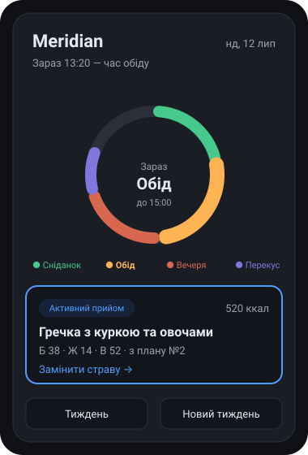

<div align="center">

# Meridian

**Планувальник харчування, що сам збирає тижневий раціон із перевірених планів дієтолога.**




[In English](README.md)

</div>

---

Meridian перетворює PDF-плани дієтолога на робочий застосунок. Розкладає їх на окремі страви й сам збирає новий тиждень — тримає калорійність і структуру дієтолога, але міксує страви з кількох планів, щоб раціон не набридав. Головний екран відповідає на одне питання: що їсти зараз.

На відміну від універсальних планувальників, він нічого не вигадує. Кожна страва — з плану, який затвердив ваш дієтолог.

## Як працює генератор

Для кожного слота добирає страву так, щоб збігався тип, денна калорійність трималась у коридорі навколо цілі (±100 ккал за замовчуванням), страви не повторювались надто часто, а тиждень спирався на кілька базових планів, а не копіював один. Це задача з обмеженнями, що розв'язується жадібно з випадковістю й обмеженим бектрекуванням. Без ML.

## Запуск

```sh
git clone https://github.com/1h8sn0w/meridian.git
cd meridian
npx serve .          # або: python3 -m http.server 8000
```

Відкривати надруковану адресу `http://localhost:…`, а не `index.html` подвійним кліком. `file://` і `localhost` — різні origin для localStorage, тож збережене в одному зникає в іншому; до того ж service worker потребує `http(s)`.

## Стек

Один HTML-файл, vanilla JS, `localStorage`, Tailwind CSS v4. Без бекенду, бандлера й фреймворка — свідомо, доки ідея не доведена. Далі — перехід на local-first: SQLite + PowerSync + Supabase.

<details>
<summary>Робота зі стилями</summary>

Runtime і деплой лишаються build-free: `index.html` і згенерований `tailwind.css` комітяться й віддаються як статичні файли. Інструментарій потрібен лише для зміни utility-класів або теми.

```sh
corepack enable pnpm
pnpm install
pnpm build:css       # одноразова детермінована збірка
pnpm watch:css       # перебудова під час редагування
```

Node.js 22+ і pnpm 11 (з V2 репозиторій — це pnpm-воркспейс, див. нижче). `tailwindcss` і `@tailwindcss/cli` зафіксовані на `4.3.3`. Preflight свідомо не підключено, щоб не змінювати нативний вигляд form controls. Перед передачею роботи запускати `pnpm build:css`. Мінімальні версії браузерів для Tailwind v4: Chrome 111, Safari 16.4, Firefox 128.

</details>

## Структура репозиторію

V1 — прототип, описаний вище, — це статичний застосунок у корені репозиторію. V2, перехід на local-first, живе поруч як pnpm-воркспейс:

| Шлях | Що це |
|------|-------|
| `apps/web` | Застосунок Vite + TanStack Start; цю саму збірку згодом загорне Capacitor |
| `packages/core` | Доменна логіка чистим TypeScript: генератор тижня, калорії, правила провенансу |
| `packages/db` | Drizzle-схема й міграції для Supabase Postgres |
| `infra` | Docker Compose, Caddyfile, конфіг PowerSync, приклад `.env` |

```sh
pnpm install
pnpm dev             # apps/web на http://localhost:3000
pnpm build           # усі пакети
pnpm lint
pnpm typecheck
pnpm format
pnpm db:migrate
```

## Документація

Контекст проєкту для AI-агентів — у [`AGENTS.md`](AGENTS.md). Архітектурні рішення, дослідження й дошка задач живуть у Linear, а не в цьому репозиторії.

## Ліцензія

[MIT](LICENSE) © 2026 Volodymyr Chornous
