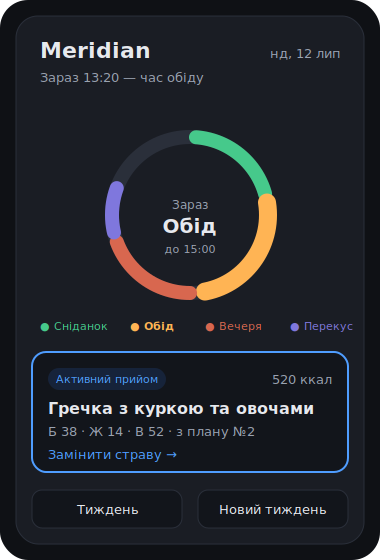

<div align="center">

# Meridian

**Планувальник харчування, що сам збирає тижневий раціон із перевірених планів дієтолога.**




</div>

---

## Про проєкт

Meridian бере плани від дієтолога (PDF), розкладає їх на окремі страви й перетворює на живий застосунок. Замість гортання PDF — головний екран показує **що їсти зараз** через годинник дня, а система **сама щотижня збирає новий раціон** із пулу страв: тримає калорійність і структуру дієтолога, але міксує страви з кількох планів, щоб не набридало.

**Чим відрізняється від Eat This Much, PlateJoy тощо:** ті планують із власних баз рецептів. Meridian планує **лише зі страв, затверджених вашим дієтологом** — медично безпечніше й персональніше.

## Ключові можливості

- **Годинник дня** — головний екран підсвічує активний прийом їжі (сніданок / обід / вечеря / перекус) за поточним часом і показує страву прямо зараз.
- **Генератор тижня** — сам збирає план на 7 днів: правильні типи страв, денна калорійність у коридорі ±100 ккал, без частих повторів, з міксом кількох планів.
- **Ручне керування** — замінити окрему страву або перегенерувати весь тиждень одним дотиком.
- **Календар** — огляд планів на будь-який день, вперед і назад.

## Ядро: як працює генератор

Для кожного дня добирає по одній страві на слот так, щоб:

1. **тип збігався** — сніданок лише на сніданок і т.д.;
2. **калорійність дня** трималась у коридорі від цілі дієтолога;
3. **не було частих повторів** — страва не частіше, ніж раз на N днів;
4. **тиждень міксував** страви з різних базових планів, а не копіював один.

Технічно — задача з обмеженнями (constraint satisfaction), розв'язується простим переборно-жадібним алгоритмом. Без важкого AI.

## Стек

| Шар | Вибір | Чому |
|-----|-------|------|
| Застосунок | Один HTML-файл + vanilla JS | Уся логіка лишається без фреймворка й бандлера |
| Дані | `localStorage` браузера | Пул страв і плани переживають перезавантаження, без акаунтів |
| UI | Tailwind CSS v4, mobile-first | Статичний зібраний CSS без runtime-залежності |
| Бекенд | немає (у POC) | Спершу довести цінність, потім нарощувати |

Після POC — перенесення на React + невеликий бекенд для синхронізації між пристроями та імпорту PDF.

## Запуск

Застосунок розгортається як готові статичні файли: `index.html` і збережений у репозиторії `tailwind.css` не потребують npm чи runtime-збірки. Для реального користування відкривайте його **через локальний сервер** (сталий `http://localhost`-origin), а не подвійним кліком: `file://` і `localhost` — це **різні origin** сховища localStorage, тож дані, збережені в одному, «зникнуть» в іншому. Через `file://` ще й не працює офлайн/PWA — service worker потребує `http(s)` або `localhost`.

```
git clone https://github.com/1h8sn0w/meridian.git
cd meridian
# будь-який статичний сервер на сталому порту, напр.:
npx serve .                 # або: python3 -m http.server 8000
# і відкрий надрукований http://localhost:… у браузері
```

Швидкий погляд без збереження — можна й подвійним кліком (`file://`). Але для збереження плану, встановлення PWA і тестів тримайтесь **однієї** `http://localhost`-адреси.

### Робота зі стилями

Tailwind CSS і CLI зафіксовані на версії `4.3.3` та потребують Node.js 20+. npm потрібен лише авторам, які змінюють utility-класи або тему; готовий `tailwind.css` комітиться разом із HTML.

```sh
npm ci
npm run build:css   # одноразова детермінована збірка
npm run watch:css   # перебудова під час редагування
```

Після зміни класів перед передачею роботи запускайте `npm run build:css`. Мінімальні версії браузерів для Tailwind v4: Chrome 111, Safari 16.4 і Firefox 128.

## Роадмап

**Фаза 1 · POC — завершено (16 лип 2026).** Головний екран з годинником дня та активною стравою, пул страв із ручним редагуванням, генератор тижня з перегенерацією та заміною окремої страви, календар. Головне доведено — генератор працює.

**Фаза 2 · V1 — наступна.** Імпорт PDF-планів, список покупок, профіль на двох, історія/улюблене, PWA + офлайн, нагадування.

## Документація

- [`AGENTS.md`](AGENTS.md) — контекст проєкту для AI-агентів (опис, ціль, стек, конвенції).
- Задачі, пріоритети й фази ведуться в Linear (команда Meridian).

## Ліцензія

[MIT](LICENSE) © 2026 Volodymyr Chornous
